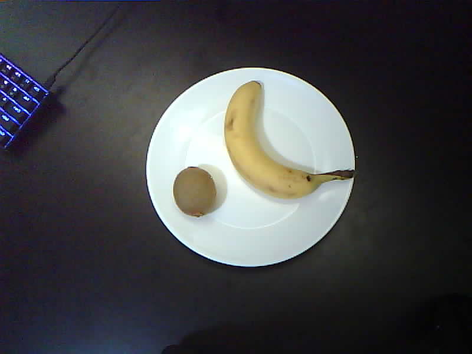

# Assets Info
This directory holds all the collected / utilized for training the produce detector model

## Structure

## File Format
Files in the dataset are of form classnameXXX.jpg 
Where classname is one of the object classifications
and 'XXX' is a its ID with padded zeros.

## Examples 
